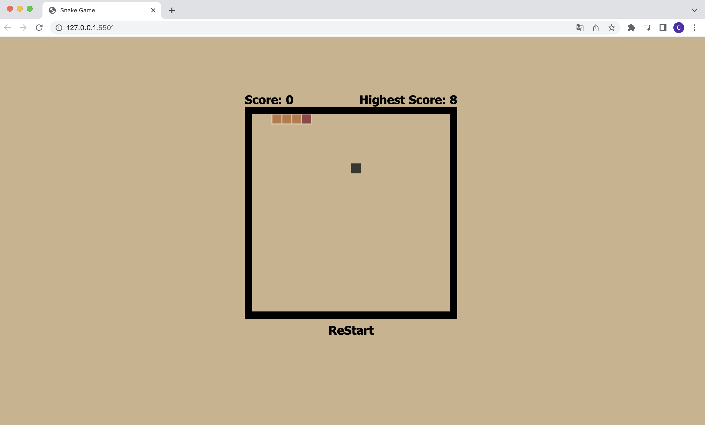

# Snake Game 經典貪食蛇 🐍

動態畫面

靜態畫面

## 📌 專案目的

透過此經典遊戲的復刻，著重在 JavaScript 的編程運用

## 🎯 專案功能

- 點擊“ReStart"按鈕可重新開始遊戲
- 根據鍵盤上的上下左右按鍵，可控制蛇的行走方向
- 依照遊戲邏輯，如蛇吃到果實，Score +1
- 儲存過往的遊戲紀錄，並將其與當前遊戲分數做判斷，並持續更新 Highest Score

## ✔️ 專案使用

1. 將專案 clone 到本地
2. 在本地開啟之後，透過終端機進入資料夾
3. 打開瀏覽器，並輸入 http://127.0.0.1:5500/ 進入首頁

## 🎮 立即體驗

點按即進入遊戲：https://cching01099.github.io/SnakeGame/
